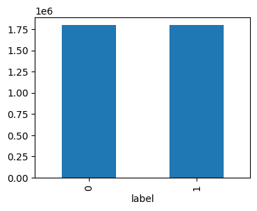
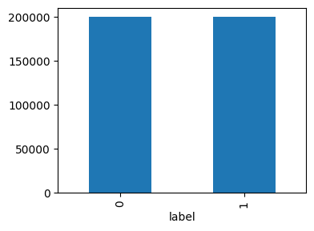
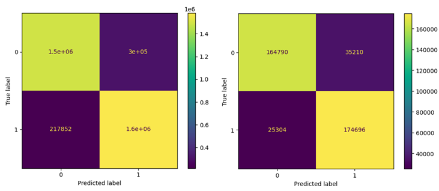
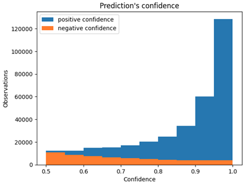

# **LAB 1 - Feature-Based Classification - Axel MEUNIER**
## **Sentiment Analysis**
### **Loading the dataset**
#### **1. Why does HuggingFace download the corpora into a cache?**

HuggingFace downloads the corpora into a cache to ensure it is not downloaded again if it was already done before and that it was not updated. In case of an update, it will keep the previous files but will download only the new one, according to HuggingFace documentation (https://huggingface.co/docs/huggingface_hub/guides/manage-cache).


#### **2. Plot the distribution of labels of test and the train set. Interpret.**
``` python
df_train = pd.DataFrame(dataset["train"])
df_train.groupby("label").size().plot(kind="bar")
```


``` python
df_test = pd.DataFrame(dataset["test"])
df_test.groupby("label").size().plot(kind="bar")
```


In the train set, the distribution of labels is exactly equivalent between label 0 and 1. For each, there are 180 000 labels, that fits the total number of 3 600 000 examples. There is the same distribution for the test set, with 200 000 labels of each, totalling 400 000 annotated examples. The distribution is equivalent for both.
 

#### **3. What are the 5 most common words in the title? (We will use a simple tokenization using spaces to identify word and lowercasing as the sole preprocessing). Interpret.**

``` python
from collections import Counter
print(
    Counter(
        " ".join(
            df_train["title"]
                .str.lower()
                .values
        ).split()
    ).most_common(5)
)
```
``` text
# output
[('the', 488026), ('a', 423730), ('not', 298203), ('of', 257353), ('great', 251930)]
```

Ths 5 most common words in the title (considering only train set) are the words "the", "a", "not", "of" and "great". They are expected words as they are english stopwords (very frequent words), as no removal has been done on the text. 


#### 4. **Why is the corpus split into a train and a test set (rather than letting users splitting the data)? Is this a good idea?**

It was split into a train and test set to ensure different trained models can be evaluated on the same data, plus there are equally distributed labels for both set. This is a good idea so different models can be compared more rigourously, being trained on the same data or at least evaluated on the same test set. 
However, by having an equally distributed labels, it could be a bad idea in the case the real data this models has to be used on doesn't include this kind of distribution; for example when the models has to look for spam vs non-spam emails, we can imagine emails are more likely non-spam. 

### **Extracting features**
#### **5. Using `sklearn`'s `CountVectorizer` build the observation matrix corresponding the train & the test sets**

``` python
vectorizer = CountVectorizer()
X_train = vectorizer.fit_transform(df_train["content"])
X_test = vectorizer.transform(df_test["content"])
print(f"X_train shape: {X_train.shape}")
print(f"X_test shape: {X_train.shape}")
```
``` text
# output
X_train shape: (3600000, 937124)
X_test shape: (3600000, 937124)
```
Only the shape was printed as it would cause a memory problem to display whole matrices with a `.toarray()`call. 

#### **6. Do you need to tokenize the data first (e.g. by separating the punctuation first)?**

It is not necessary to tokenize the data first as sklearn can do it, but it leaves us the option to apply our own tokenizer. 


#### **7. What are stop words and why we should not consider them as features?**

Stop words are words that are over represented and not carrying a lot of information (such as short grammatical words). They should not be considered as features as they will extand the number of dimension of our matrices while not being really usefull for the task we want to do. 

#### **8. Do we need to use a pre-computed list of stop words? (look at the `max_df` parameter)**

It is not necessary as in sklearn library they can be handled by setting a `max_df` parameter that can be either between 0 and 1 to set a percentage of maximum document frequency for the words we want to eliminate, or  above 1 to set a number of most represented words to eliminate.

#### **9. Why should we set the `min_df` value to 2?**

We should do it so any word that is occuring in less than 2 document are eliminated. It is usefull as they're most likely hapax and might extenda lot the vocabulary (for example if we have even a typo in a document it would count as a word of our vocabulary).

#### **10. Compute the vocabulary size when `min_df` is set to 1 or to 2.**

By running the code given in question 5, adding the code below,

``` python
print(len(vectorizer.vocabulary_))
```
we obtain: 

`min_df=1` : vocabulary size of 937124.

`min_df=2` : vocabulary size of 355610.


### **Training & Evaluating a Classifier**
#### **11. Using the data you have just prepared, train a logistic regression considering as features either the content or the title Evaluate the accuracy of your classifier on the train & on the test set and plot the confusion matrix. Interpret.**

 ```python
 from sklearn.linear_model import LogisticRegression
from sklearn.metrics import accuracy_score, ConfusionMatrixDisplay
import matplotlib.pyplot as plt

X_train = vectorizer.fit_transform(df_train["title"])
X_test = vectorizer.transform(df_test["title"])

Y_train = df_train["label"]
Y_test = df_test["label"]

model = LogisticRegression(max_iter=1000)

model.fit(X_train, Y_train)
train_pred = model.predict(X_train)
test_pred = model.predict(X_test)

train_acc = accuracy_score(Y_train, train_pred)
test_acc = accuracy_score(Y_test, test_pred)

print(f"Train accuracy: {train_acc}")
print(f"Test accuracy: {test_acc}")

train_conf_plot = ConfusionMatrixDisplay.from_estimator(
                                                        model, 
                                                        X_train, 
                                                        Y_train
                                                        )
test_conf_plot = ConfusionMatrixDisplay.from_estimator(
                                                        model, 
                                                        X_test, 
                                                        Y_test
                                                        )

plt.show()
```
```text
# output
Train accuracy: 0.8550225
Test accuracy: 0.848715
```


The classifier shows good results according the the diagonals from top left to bottom right, meaning the prediction corresponds to the gold classes (both must be 0 or 1). It seems however better to predict class 1 (bottom right), as there is more cases but we know that we had evenly distributed classes initially.

#### **12. How can you use your classifier to estimate the confidence in the predicted label? Plot the confidence distribution for example that are correctly identified and examples that are misclassified.**

We can do it by using the `.predict_proba` method of our classifier and filter where the confidence is positive or negative, based on a comparison with the gold class. 

```python
proba_test = model.predict_proba(X_test)
total_conf = np.max(proba_test, axis=1)

pos_conf = total_conf[Y_test == test_pred]
neg_conf = total_conf[Y_test != test_pred]

plt.hist(pos_conf, label="positive confidence")
plt.hist(neg_conf, label="negative confidence")

plt.xlabel("Confidence")
plt.ylabel("Observations")
plt.title("Prediction's confidence")
plt.legend()
plt.show
```



Confidence is how the model is confident in its predictions, so the results are looking good as it is confident when it does good predictions and it is not when it does not. 

#### **13. Using l1 regularization, identify the 100 most relevant words identified by the model. You should consider the l1_min_c function**

I must admit that for this question I did not find a good solution by myself after trying to understand how to use the l1 regularization for this purpose. The code below was barely modified from a solution given by our favorite LLM (I only added the use of the `l1_min_c` function that it didn't properly find in sklearn, modified the solver and obviously the C hyperparameter).
I left the weight print so it could help to visualize weither it worked properly or not.
X_train was based on the titles only.

```python
from sklearn.svm import l1_min_c

C = l1_min_c(X_train, Y_train, loss="log") * 10 
# update: I was adviced to make it higher by multiplying 
# by a value otherwise I had only 0's

model = LogisticRegression(solver="liblinear", 
                           penalty="l1", 
                           C=C, 
                           max_iter=1_000)

model.fit(X_train, Y_train)

coefs = model.coef_[0]
words = np.array(vectorizer.get_feature_names_out())

top100_idx = np.argsort(np.abs(coefs))[::-1][:100]
top100_words = words[top100_idx]
top100_coefs = coefs[top100_idx]

for word, weight in zip(top100_words, top100_coefs):
    print(word, weight)
```
```text
# output
not -1.7867768474062515
great 1.6077645158391736
best 1.2484105240628514
excellent 1.2113418418027566
poor -0.8820546173547541
good 0.8169315007444201
love 0.7759692760979884
don -0.7536358391481106
waste -0.6181510329847543
bad -0.5574075865729993
...
```

#### **14. Is it reasonable to set min_df at 2? Why?**

As explained in the question 9, it can be reasonable to remove words occurring in one document only (less than 2), that would eliminate typo for example. These words would not even count with the regularization that would put them at 0, so it is not necessary to compute them before.

#### **15.Split the dataset into a train (90% of the data) and a test set (10%) and train a logistic regression classifier considering the tf.idf representation of the 3-grams (of characters). What is its accuracy?**


```python
df = pd.read_csv("/content/sample_data/lid201-medium.tsv",
                  sep="\t",
                  usecols=[0, 1],
                  names=["content", "label"])

df = df.sample(20_000) # a sample was enough to get not bad results
train, test = train_test_split(df, train_size=0.9)

vectorizer = TfidfVectorizer(analyzer="char",
                             ngram_range=(3,3)
                             )

model = LogisticRegression(solver="liblinear")

X_train = vectorizer.fit_transform(train["content"])
Y_train = train["label"]

X_test = vectorizer.transform(test["content"])
Y_test = test["label"]

model.fit(X_train, Y_train)

Y_train_pred = model.predict(X_train)
Y_test_pred = model.predict(X_test)

train_acc = accuracy_score(Y_train, Y_train_pred)
test_acc = accuracy_score(Y_test, Y_test_pred)

print(f"Train accuracy: {train_acc:.3f}")
print(f"Test accuracy: {test_acc:.3f}")
```
```text
# output
Train accuracy: 0.918
Test accuracy: 0.840
```
#### **16. What is the average sentence length (in characters)? Divide the data into two groups: sentences shorter than the median length and sentences longer than the median length. Is the accuracy the same for the two groups?**

```python
mean, median = train["content"].str.len().agg(["mean", "median"])
print(f"Average sentence length: {mean:.3f}")

shorter = train["content"].str.len() < median
longer = train["content"].str.len() > median

short_acc = accuracy_score(Y_train[shorter], Y_train_pred[shorter])
print(f"Shorter length sentence accuracy: {short_acc:.3f}")

longer_acc = accuracy_score(Y_train[longer], Y_train_pred[longer])
print(f"Longer length sentence accuracy: {longer_acc:.3f}")
```
```text
# output
Average sentence length: 125.012
Shorter length sentence accuracy: 0.881
Longer length sentence accuracy: 0.955
```
The accuracy is different for the two groups: the longer sentences have a higher accuracy than the shorter ones. It is expected as the longer the sentence is, the more 3-gram the classifier gets to predict the correct class. 

#### **17. Compute the confusion matrix and compute the precision/recall for each class. What can you conclude?**

```python
conf_mat = confusion_matrix(Y_train, Y_train_pred)
print(conf_mat)

print(classification_report(Y_train, Y_train_pred))
```
```text
# output
[[  0   0   0 ...   1   0   0]
 [  0   0   0 ...   0   0   0]
 [  0   0   0 ...   1   0   0]
 ...
 [  0   0   0 ... 314   0   0]
 [  0   0   0 ...   0   0   0]
 [  0   0   0 ...   3   0 137]]

                precision    recall  f1-score   support

    ace_Arab       0.00      0.00      0.00         3
    ace_Latn       0.00      0.00      0.00         3
    aeb_Arab       0.00      0.00      0.00         4
    afr_Latn       1.00      0.95      0.97       183
                        ...
    zho_Hans       1.00      0.98      0.99       176
    zho_Hant       0.33      1.00      0.49       314
    zsm_Latn       0.00      0.00      0.00        66
    zul_Latn       0.91      0.94      0.93       145
```
In general the model classify well the languages but for some it systematically fails (ace_Arab for example). It could be explained by the size of the sample, including very few example that were not properly classified. Overall the Latin alphabet languages seems to be well classified but it is less the case with Arabic one (same alphabet but maybe different kind of words / grammar we can suppose). 

#### **18. Explain how the previous function is working**

The previous function is looking for the unicode of each character and returns a set of all the results (for example {"Latin", "Latin", "Latin"})

#### **20. Implement this principle. Does it improve the performance?**

```python
train["script"] = train["label"].str.split("_").str[-1]
test["script"] = test["label"].str.split("_").str[-1]

for script in train["script"].unique():
    train_script = train[train["script"] == script]
    test_script = test[test["script"] == script]
    
    vectorizer = TfidfVectorizer(analyzer="char", 
                                ngram_range=(3,3),
                                dtype=np.float32)
    
    model = LogisticRegression(solver="liblinear")
    
    X_train = vectorizer.fit_transform(train_script["content"])
    Y_train = train_script["label"]
    
    X_test = vectorizer.transform(test_script["content"])
    Y_test = test_script["label"]
    
    model.fit(X_train, Y_train)
    
    Y_train_pred = model.predict(X_train)
    Y_test_pred = model.predict(X_test)
    
    train_acc = accuracy_score(Y_train, Y_train_pred)
    test_acc = accuracy_score(Y_test, Y_test_pred)
    
    print(f"Train accuracy for {script}: {train_acc:.3f}")
    print(f"Test accuracy for {script}: {test_acc:.3f}")
```
```text
# output


```

It should be faster as I could not even run the medium dataset on colab (RAM saturated, that explains also the choice I made to set dtype as float 32 instead of 64).